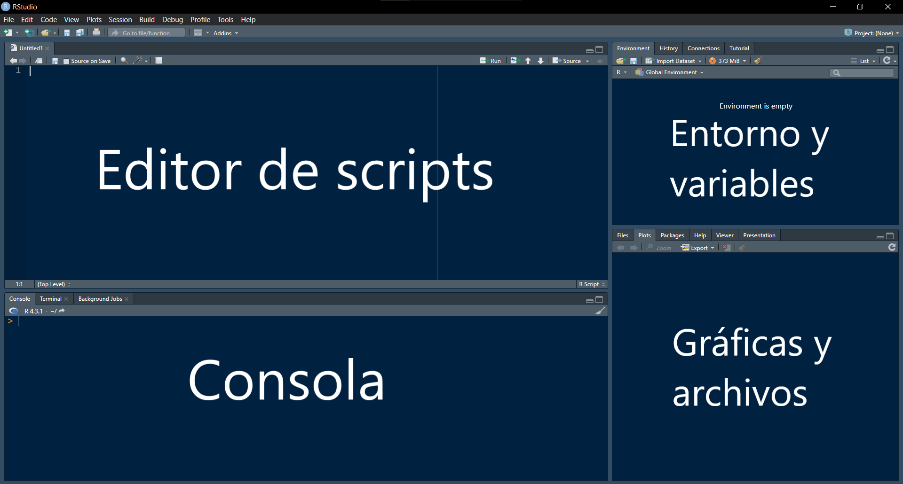

## Notas

Este es un documento *R Markdown*. *Markdown* es una sintaxis de formato simple para crear archivos HTML, PDF y MS Word. Para más detalles en el uso de **R Markdown** revisen <http://rmarkdown.rstudio.com>. Si es la primera vez que utilizas este tipo de archivos en tu versión actual de RStudio, deberas instalar la libreria "knitr" usando el siguiente comando:

```{r}
# Correr una unica vez desde la instalación de R o después de una actualización de R
install.packages("knitr")
```

Cuando haces clic en el botón **knit** se generará un documento que incluye el contenido y la salidas de las secciones de código incluidas en el archivo Markdown. Adicionalmente, tendrás que cargar la librería a la sesión actual de R:

```{r}
library(knitr)
```

```{r setup, include=FALSE}
knitr::opts_chunk$set(echo = TRUE)
```

# Introducción a R

**R**, además de ser un lenguaje de programación, es un software estadístico y una plataforma para paquetes de análisis. Ofrece funciones y algoritmos estadísticos tradicionales y permite crear algoritmos propios. **R** es usado para la manipulación de datos, análisis estadístico, simulaciones y gráficas.

**R** es una implementación del lenguaje **'S'**, desarrollado en *Bell laboratorios* por Rick Becker, John Chambers y Allan Wilks (1976), siendo la base de 'S-plus'. **R** fue escrito inicialmente por Ross Ihaka y Robert Gentleman del Departamento de estadística de la Universidad de Auckland, Nueva Zelanda en 1993.

## Interacción con R y RStudio

### RStudio

***RStudio*** es el entorno integrado de desarrollo más usado para trabajar con el lenguaje ***R*** fundado por J.J. Allaire. En esta oportunidad usaremos su versión *RStudio desktop*, que es la aplicación para escritorio (también existe una versión para ser utilizada en un servidor remoto). Complementa el lenguaje con múltiples funciones como la utilizada en la presente guía: ***RMarkdown***.

La interfaz por defecto es la siguiente:



*Editor de scripts:* Inicialmente el editor de Scripts funciona como cualquier tipo de editor en otros IDE (Spyder, Visual Studio, Eclipse) donde se modifica directamente un archivo. Este se puede crear desde la interfaz de RStudio a través de *File \> New File \> R Script*. Esto abrirá un nuevo archivo en el editor donde se podrán añadir lineas de código y hacer ejecuciones completas de un programa o *Script*. Sin embargo, hoy utilizaremos la función integrada de **RMarkdown** que permite crear un *Notebook* en RStudio (similar a otros notebooks como *Jupyter Notebooks*). De esta forma podremos correr lineas de comandos de R a la vez que incluimos lineas de texto.

*Consola:* Además de los scripts, los comandos de R también pueden ser ejecutados de forma directa en la consola luego de escribirlos frente al símbolo *"\>"*. Luego de escribir el comando y pulsar la tecla **enter** nos aparecerá el resultado.

*Entorno y variables:* En el panel superior derecho de RStudio se podrán observar las variables guardadas (pestaña *Environment*), el historial de comandos ingresados (pestaña *History*), realizar conexiones a otro tipo de datos (pestaña *Connections*) y algunos tutoriales interactivos (pestaña *Tutorial*).

*Gráficas y archivos:* En este panel se podrá ver la lista de archivos del directorio actual (*Files*, desde donde se están ejecutando los códigos); las futuras gráficas a ser creadas (*Plots*); además de una lista de las librerías o paquetes instalados (*Packages*) y una ventana donde se mostrará la documentación de funciones y comandos para los que se podrá solicitar ayuda (*Help*, cuyo uso se verá más adelante).

Finalmente, como en la mayoría de programas, en la parte superior de la ventana se muestran las opciones de la barra de herramienta que nos permite interactuar con otras funciones de RStudio.

## Trabajando con R

Una vez que conocemos un poco sobre la interfaz de **RStudio**, podemos iniciar con la introducción con el lenguaje de programación de interés: **R**.

### Tipos de archivo

En **RSutdio** se pueden editar dos formatos principales de archivos de código o *Scripts* soportados por el lenguaje de programación de **R**: *.R* y *.Rmd*. Los *scripts .R* son los archivos de código básicos sobre los cuales se pueden programar múltiples líneas de código o la creación de un programa completo. Un ejemplo de este tipo de archivos es el archivo [script_ejemplo.R](./script_ejemplo.R). Este archivo contiene múltiples lineas de código que al ser ejecutadas muestran los resultados en la consola de **RStudio.**

Por otro lado, los archivos *.Rmd* son archivos que permiten desarrollar código de R de forma dinámica, ya que integra bloques de código, texto o gráficas. Son similares a los *notebooks* de *Jupyter* (desarrollados en *Python*), sin embargo permiten una mayor dinamización de la edición de los bloques de texto al utilizar el formato *.md (MarkDown)* que es muy útil en la edición de documentos. El presente documento es un ejemplo claro de como funcionan este tipo de archivos *.Rmd* o ***Rmarkdown**.* Podrá cada una de las secciones de código en lenguaje R embebidas en el documento de texto, las cuales se pueden ejecutar de forma individual.

A lo largo del siguiente documento podrá familiarizarse con el funcionamiento de este tipo de archivos tipo *notebook*, mientras aprende de los conceptos básicos de la programación en R.

### Funciones básicas

Similar a otros lenguajes de programación, en **R** se pueden realizar operaciones matemáticas básicas. Por ejemplo (para ejecutar el código puede dar clic en el icono del triángulo verde en la esquina superior derecha de cada sección de código):

```{r}
20+30
79-36
100/4
26*980
7%/%3
2+3*2-2^3
(1+3)*99/3^2
```

Funciones y exponentes:

```{r}
log(2)
sqrt(16)
3^3
3**3
```

Adicionalmente, hay algunos comandos o funciones básicas en **R** que son claves para su uso (existen muchos más que pueden ser buscados en la documentación de **R** o en internet). Usualmente estos comandos están descritos como una función con un nombre y un argumento entre paréntesis:`comando(argumento)`. Los argumentos podrán variar dependiendo del comando que se quiera utilizar, pero generalmente corresponden a un conjunto de datos que queremos analizar, un parámetro que será utilizado para el análisis o una función integrada de **R**. Por ejemplo, uno de los comandos más usados es el comando `help()`:

```{r}
help(mean)
```

Este comando busca en la documentación la información correspondiente a una función o comando integrado de **R** y la muestra en el panel de *Gráficas y archivos*. Para este comando es necesario conocer la notación correcta del comando que se quiere buscar. Sin embargo, también es posible usar otra función si no se tiene certeza de cuál es el nombre exacto del comando que se desea utilizar:

```{r}
help.search("anova")
```

Otras variaciones para las funciones/comandos utilizados anteriormente son las siguientes:

```{r}
?mean #busqueda exacta del comando "mean"
??anova #busqueda inexacta del comando "anova"
apropos("anova")
```

Otro comando útil es `help.start()` el cual abre una ventana general de búsqueda que contiene manuales y otros recursos útiles para utilizar **R**:

```{r}
help.start()
```

Finalmente, también existe un comando para finalizar la sesión de **R**:`q()`. Este comando abrirá una ventana emergente donde nos preguntará si queremos guardar el "área de trabajo", la cual corresponde a todas los objetos o variables creados durante la sesión actual. Esta área de trabajo se guardará como un archivo con formato `.rdata`, para el cual solicitará indicar el directorio de destino.

*Bonus:* Como lo habrán notado, cuando se escribe código de programación en R, el símbolo `#` sirve para incluir texto como documentación en un script, el cual no genera o inicia ningún proceso. Solo sirve como información adicional respecto a alguna linea de código descrita.

### librerías y Paquetes

El lenguaje **R** está construido como un conjunto de librerías que permiten realizar diferentes aplicaciones estadísticas, numéricas, gráficas, de procesamiento de texto, entre otros. Cada una de estas librerías están compuestas por **Paquetes** que incluyen funcionalidades más específicas. Algunos de estos ya están incluidos por defecto en **R**. Para ver los incluidos se puede utilizar el comando`library()`:

```{r}
library()
```

sin embargo, otros paquetes no incluidos (más de 13000) pueden ser descargados e instalados desde el repositorio de *CRAN* (<https://cran.r-project.org/>). Para esto se debe utilizar el comando `install.packages()` ingresando como argumento el paquete que quiere ser instalado:

```{r, include=FALSE}
install.packages("ggplot2")
```

Para revisar todos los paquetes instalados e información relacionada de cada uno se puede usar `installed.packages()`.

Una vez se ha instalado un nuevo paquete, estará disponible en tu computador para sesión de **R** futuras (en la versión de R para cual fue instalado). No obstante, para usar su contenido y funciones en cada sesión iniciada es necesario usar el comando (con el nombre del paquete correspondiente):

```{r}
library(ggplot2)
```

## Objetos

La definición de un *objeto* o una *variable* cumple el propósito de almacenar un valor o elemento bajo un nombre, con el fin de poder almacenarlo y utilizarlo o modificarlo posteriormente. Para asignar un valor a un objeto o variable se utiliza el operador `<-`. Por ejemplo:

```{r}
y<-5 #se guarda el valor '5' dentro de una variable con nombre 'y'
x<-20
altura<-1.30
z<-x+y #Se pueden utilizar las variables creadas anteriormente para crear una 
       #nueva
```

De esta forma se crean nuevas variables que ya contienen un valor de un tipo de dato en específico. Para conocer el tipo de objeto se puede utilizar el comando `mode(nombre_del_objeto)` o `class(nombre_del_onjeto)`. Adicionalmente, para poder ver el valor de cada objeto o variable (en consola) simplemente se puede ingresar el nombre de dicha variable como un comando único:

```{r}
x
y
z
```

Esta misma asignación se puede realizar para otro tipo de datos un poco más complejos, como los que se verán a continuación.

### Vectores

Uno de los objetos más utilizados en **R** son los vectores, los cuales se definen como un arreglo de elementos de un mismo tipo de dato. Para crear un vector se utiliza el comando `c()`, ingresando cada elemento del arreglo como un argumento de la función separados por comas:

```{r}
tiempo<-c(34,13,65,10) #vector de tipo numérico
tiempo
```

Adicional a los vectores de tipo numérico, los vectores también pueden ser de tipo caracter, lógico o complejo:

```{r}
estacion<-c("seca","semiseca","semilluviosa","lluviosa")
estacion
vectorLogico<-c(TRUE,FALSE)
vectorLogico
```

Los vectores numéricos son de especial interes en el uso de **R**. Inicialmente se pueden utilizar con operaciones matemáticas:

```{r}
tiempo+5
tiempo*2 + 20
```

Existen otras formas de definir vectores si se desean crear con una formula, secuencia o repetición en específico. Puede explorar estas opciones con el siguiente código:

```{r}
4:12 #vector inicio:final
rep(8,10) #valor, frecuencia
seq(0, 10, 2.5) "inico, fin, paso"
rep(5, times=5)
rep(c(3, -1, 0.5), times=3)
rep(c(3, -1, 0.5), length.out=8)

seq(0, 10, 2.5)
```

Una vez creado un vector, se puede acceder a cada uno de los elementos utilizando la posición de cada uno dentro del vector. Para esto se utilizan los símbolos `[]`:

```{r}
tiempo[3]
estacion[2]
```

También se pueden seleccionar varias posiciones usando la notación de vectores `c()` o el símbolo `:`:

```{r}
estacion
estacion[c(2,4)]
estacion[2:4]
```

Una función útil en el manejo de vectores es la función `length()`, la cual nos indica la longitud (número de elementos) de un vector.

```{r}
length(tiempo)
length(estacion)
```

### Matrices

Otro tipo de objeto para el almacenamiento de valores son las matrices, las cuales tienen una gran importancia matemática. En esta objeto los datos se organizan en un arreglo de 2 dimensiones, organizados en filas y columnas. Para crear este tipo de objetos se utiliza el comando `matrix()` y requiere más de un argumento: `matrix(data=NA, nrow=1, ncol=1, byrow=FALSE, dimnames=NULL)`. Estos argumentos significan:

-   `data` es el vector de datos que queremos incluir en la matriz.

-   `nrow` es el número de filas de la matriz

-   `ncol`es el número de columnas

-   `byroww`indica si queremos llenar la matriz por filas. Por defecto la matriz se llena por columnas

-   `dimnames` permite incluir una lista de 2 elementos que contenga los nombres de las filas y las columnas de la matriz.

Por ejemplo, si se quiere una matriz de 3 filas y 3 columnas (3X3) con los números del 1 al 9:

```{r}
matriz.numeros<-matrix(1:9, nrow=3, byrow=TRUE)
matriz.numeros
```

Otro ejemplo con elementos de tipo carácter:

```{r}
matriz.meses<-matrix(c("January", "February", "March", "April", "May", "June",
"July", "August", "September", "October", "November",
"December"), nrow=3, byrow=TRUE)
matriz.meses
```

Una vez creada la matriz, se puede obtener sus dimensiones con la función `dim()`:

```{r}
dim(matriz.meses)
```

La forma de acceder a los elementos de una matriz es similar que para los vectores, pero utilizando dos dimensiones:

```{r}
matriz.meses[2,3]
matriz.meses[,4] #¿Qué hace este comando? ¿Porque falta la primera dimensión?
matriz.meses[1,] #¿Qué hace este comando? ¿Porque falta la segunda dimensión?
```

Finalmente, al igual que con los vectores, las matrices numéricas también pueden ser sometidas a operaciones matemáticas:

```{r}
matriz.numeros * 3
matriz.numeros ^ 2
```

### Listas

Tanto las matrices como los vectores solo permiten almacenar datos del mismo tipo. Sin embargo, es posible que queramos organizar datos de distinto tipo en un mismo objeto y de forma organizada. Para esto están las **listas**, las cuales pueden almacenar datos de distinta naturaleza:

```{r}
lista.ejemplo<-list(35,"texto",FALSE)
lista.ejemplo
```

Incluso puede almacenar arreglos de diferente naturaleza como vectores y matrices:

```{r}
lista.ejemplo2<-list(matriz.meses, estacion, tiempo)
```

Finalmente, el acceso a los elementos de una lista es similar a como se realiza para los vectores y las matrices, utilizando `[]`. No obstante, tiene sus particularidades. ¿Como accedería al segundo elemento del primer elemento de la lista `lista.ejemplo2`?:

```{r}
lista.ejemplo2[[1]][2,]
```

### Dataframes

Además de las listas, existe otro tipo de objeto es la estructura de datos principal en **R** para el análisis estadístico. Los **Dataframes** también almacenan datos de diferentes tipos de clases, pero con una estructura similar a una tabla de datos. Es decir, almacenas filas y columnas de forma similar a una matriz.

La creación de un dataframe se puede realizar a partir de vectores con la misma cantidad de elementos usando la función `data.frame()`:

```{r}
# Vectores con diferentes datos
name <- c("Alfonso", "Carlos", "Lluis", "Diego")
last.name <- c("Zamora", "Quesada", "Hurtado", "Mondejar")
second.last.name <- c("Saiz", "Gonzalez", "Gil", "Ruiz")
age <- c(33, 32, 30, 37)
phd <- c("math", "math", "physics", "math")
office <- c(4, 14, 6, 8)
from.madrid <- c(FALSE, TRUE, FALSE, TRUE)
# Creación del dataframe
professors <- data.frame(name, last.name, second.last.name, age,
phd, office, from.madrid)

str(professors) #Código para resumir la información contenida en cada elemento
                # del dataFrame
```

Por otro lado, el acceso a los elementos de un dataframe se puede realizar de forma similar a las matrices, utilizando `[]`:

```{r}
professors[2, 3]
professors[1, ]
professors[, 2]
```

Una de las ventajas de los **dataframes** es que se asignan nombres a las columnas de datos usando los nombres de las variables de cada vector:

```{r}
colnames(professors)
```

Se pueden utilizar estos nombres para acceder a los diferentes elementos usando el símbolo `$` después del nombre del dataframe y luego seleccionando el nombre de alguna de las columnas:

```{r}
professors$second.last.name
professors$office[3]
```

#### Subset de datos

Adicionalmente, los **dataframes** pueden servir para obtener muestras especificas de los datos de acuerdo a los criterios deseados por el usuario, o hacer "subsetting" de los datos. Esto se realiza con la función `subset(data_frame, subset=logical_condition)` aplicando operadores lógicos comunes de la mayoría de lenguajes de programación ('\>', '\>', '\<=', '\>=', '==', '!='):

```{r}
subset(professors, subset=age < 31)
subset(professors, subset=phd == "math")
```

## Otros elementos del lenguaje

Otros comandos y funciones que pueden ser útiles:

```{r}
.libPaths() # Obtiene la ubicación de todas las librerías instaladas
search()    # genera una lista de los paquetes cargados
example(ceiling) # Muestra un ejemplo de la función ceiling. Se puede usar para 
                 #  buscar un ejemplo de cualquier función o comando. 
```

------------------------------------------------------------------------

## EJERCICIOS

Para cada uno de los ejercicios planteados deberá imprimir sus resultados. En otras palabras, luego de correr cada bloque de código se deberá mostrar la solución del ejercicio (puede usar la función `print()` o simplemente indicar el nombre de la variable.

1.  Creación de vectores y matrices

<!-- -->

a.  Cree un vector de una secuencia de números pares del 0 al 100

```{r}

vector_pares<-seq(0,100,2)
vector_pares

```


b.  Cree una matriz 3 X 5 que contenga todos los números consecutivos entre 16 y 30 por columnas:

```{r}
num.consecutivos <- seq(16, 30)
matriz.consecutivos <- matrix(data=num.consecutivos, nrow=3, ncol=5, byrow=FALSE)
matriz.consecutivos
```

c.  Para la matriz X que se muestra en la siguiente sección de código, busque los comandos (`?` y `help`) y obtenga el determinate, la diagonal, la matriz transpuesta y la matriz inversa:

```{r}
X<-matrix(c(1,2,3,1,4,6,2,-3,-5),ncol =3,nrow= 3)
X
# Agregue las funciones:
# determinante:
determinante.X <- det(X)
print("Determinante: ")
print(determinante.X)


# diagonal:
diagonal.X <- diag(X)
print("Diagonal: ")
print(diagonal.X)

# transpuesta:
transpuesta.X <- t(X)
print("Transpuesta: ")
print(transpuesta.X)

# inversa 
inversa.X <- solve(X)
print("Inversa: ")
print(inversa.X)
```

2.  Concatenación de vectores

Otra forma de obtener matrices se puede realizar con la concatenación de vectores. Para realizar esto se utilizan las funciones `cbind()` y `rbind()`:

a.  Investigue el funcionamiento de las funciones `cbind()` y `rbind()` y empléelas para concatenar los siguientes vectores:

```{r}
vector_1 <- c(1:21)
vector_2 <- c(25:45)
vector_3 <- c(11:31)

# Agregue la concatenación de los vectores
# cbind()
matriz.columnas <- cbind(vector_1, vector_2, vector_3)
print("Matriz por columnas: ")
print(matriz.columnas)

#rbind()

matriz.filas <- rbind(vector_1, vector_2, vector_3)
print("Matriz por filas: ")
print(matriz.filas)
```

b.  ¿Cuáles son las dimensiones de las matrices resultantes luego de aplicar ambas funciones de concatenación? Incluya el código usado para determinar las dimensiones de ambas matrices:

```{r}
# matriz obtenida usando cbind()
dimension.matrizc <- dim(matriz.columnas)
print("Dimensión Matriz usando cbind")
print(dimension.matrizc)

# matrices obtenidas usando rbind()
dimension.matrizf <- dim(matriz.filas)
print("Dimensión Matriz usando rbind")
print(dimension.matrizf)
```

Respuesta:

-   Dimensión concatenando los vectores con cbind(): (21, 3)

-   Dimensión concatenando los vectores con rbind(): (3, 21)

3.  Asignación de nombres a vectores y matrices

Otra de las propiedades de los vectores es que se puede acceder a sus elementos asignando nombres a cada uno de ellos con la función `names()`. De esta forma se puede acceder a los elementos de un vector usando sus nombres, en vez de su ubicación.

a.  Cree un objeto de nombre `temperaturas` y asigne 7 valores desde los 27 hasta los 33 °C. Luego asigne los días de la semana a cada temperatura como nombres:

```{r}

temperaturas <- seq(27, 33, 1)

names(temperaturas) <- c("Lunes", "Martes", "Miercoles", "Jueves", "Viernes", "Sabado", "Domingo")

temperaturas

```

b.  ¿Cuáles fueron las temperaturas para los días Lunes y sábado?:

```{r}
print("Temperatura para Lunes")
lunes <- temperaturas["Lunes"]
print(lunes)

print("Temperatura para Sabado")
sabado <- temperaturas["Sabado"]
print(sabado)

```

c.  La asignación de nombres también se puede realizar a las columnas y las filas de una matriz usando las funciones`colnames()` y `rownames()`. Cree una matriz que tenga como columnas los valores de temperatura del punto anterior en la primera fila y los valores del vector `Rains` en la segunda fila. Luego asigne nombres a las columnas con los días de la semana y a las filas con los valores ["Temperaturas", "Lluvias"]:

```{r}
rains<-c(0,5,6,0,2,3,7)

# Creación de la matriz
matriz.temp <- rbind(temperaturas, rains)

#asignación de nombres
colnames(matriz.temp) <- c("Lunes", "Martes", "Miercoles", "Jueves", "Viernes", "Sabado", "Domingo")

rownames(matriz.temp) <- c("Temperaturas", "Lluvias")

matriz.temp

```

4.  Subsetting de dataframes

**R** tiene múltiples bases de datos por defecto que pueden ser utilizadas para hacer ejercicios del análisis de **dataframes**. La lista de estos dataframes se puede obtener usando el comando:

```{r}
data()
```

Una de estas bases de datos se llama `OrchardSprays`. Para obtener la base de datos puede usar el comando `data()` o simplemente puede asignar el nombre de dicha base de datos a una nueva variable. Para esta base de datos obtenga:

a.  Los valores de la variable de respuesta `decrease` mayores a 50:

```{r}
data("OrchardSprays")
decrease.mayor.50 <- OrchardSprays$decrease[OrchardSprays$decrease > 50]
decrease.mayor.50
```

b.  Los valores de la variable de respuesta `decrease` menores a 70 y valores de la variable `rowpos` igual a 8:

```{r}
data("OrchardSprays")
decrease.70.rowpos.8 <- OrchardSprays[OrchardSprays$decrease > 70 & OrchardSprays$rowpos == 8, ]
decrease.70.rowpos.8
```

c.  Los valores correspondientes al tratamiento 'A':

```{r}
data("OrchardSprays")
tratamiento.A <- OrchardSprays$treatment[OrchardSprays$treatment == "A"]
tratamiento.A
```
